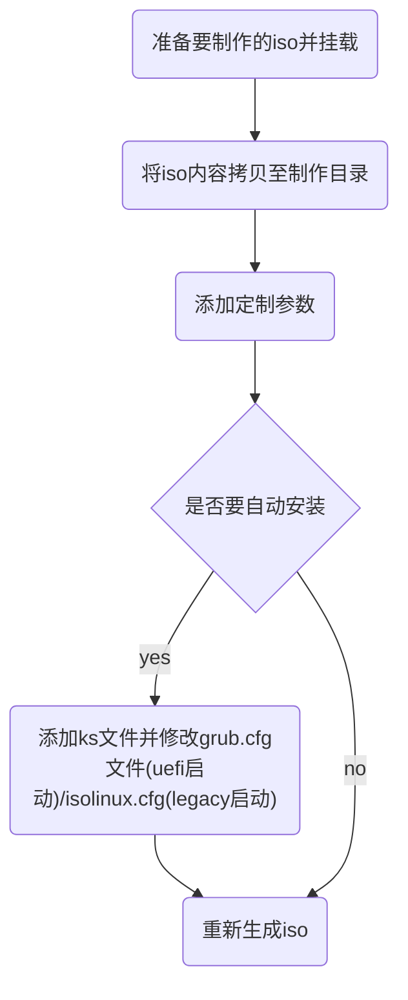

## 制作定制iso
### 定制iso制作
 #### 基本流程


#### 手动制作iso流程说明
-  首先挂载iso文件到指定目录 
    ```shell
    mount xxx.iso /mnt
    ```
-  拷贝iso下的所有内容
    ```shell
    mkdir  /home/ISO/;cp -pra /mnt/ /home/ISO/
    ```
- 添加修改
- 重新打包生成iso

#### 手动更新安装环境说明(不同架构)
- 手动更新安装环境的主要流程
   - 解压
   ```shell
   unsquashfs install.img
   ```
    - 挂载
   ```shell
   mount squashfs-root/LiveOS/rootfs.img /mnt
	```
    - 修改
   进入上述挂载目录（即安装环境根目录的挂载目录）修改
   
   - 退出卸载
   
   - 重新打包install.img镜像
   注：重新打包前需要删除原来的install.img
   
#### 重新打包install.img镜像命令说明(不同架构)
- amd64
`mksquashfs squashfs-root install.img -comp xz -Xbcj x86`
- arm64
`mksquashfs squashfs-root install.img -comp xz`
- loongarch64
`mksquashfs squashfs-root install.img -comp xz`

#### 重新打包iso命令说明(不同架构)
- amd64
`/usr/bin/genisoimage -untranslated-filenames -volid xxOS -J -joliet-long -rational-rock -translation-table -input-charset utf-8 -x ./lost+found -b isolinux/isolinux.bin -c isolinux/boot.cat -no-emul-boot -boot-load-size 4 -boot-info-table -eltorito-alt-boot -e images/efiboot.img -no-emul-boot -o /path/xxos-x86_64-release.iso -graft-points /home/xxOS/`
- arm64
`/usr/bin/genisoimage -untranslated-filenames -volid xxOS -J -joliet-long -rational-rock -translation-table -input-charset utf-8 -x ./lost+found -eltorito-alt-boot -e images/efiboot.img -no-emul-boot -o /path/xxos-aarch64-release.iso -graft-points /home/xxOS/`
- loongarch64
`/usr/bin/genisoimage -untranslated-filenames -volid xxOS -J -joliet-long -rational-rock -translation-table -input-charset utf-8 -x ./lost+found -eltorito-alt-boot -e images/efiboot.img -no-emul-boot -o /patch/xxos-loongarch64-release.iso -graft-points /home/xxOS/`

#### 添加自动安装
- 

##### ks文件简介
